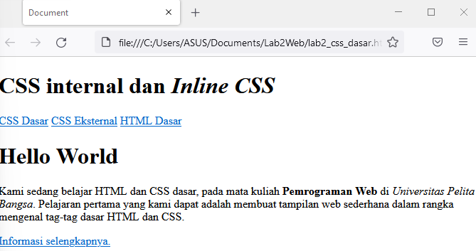
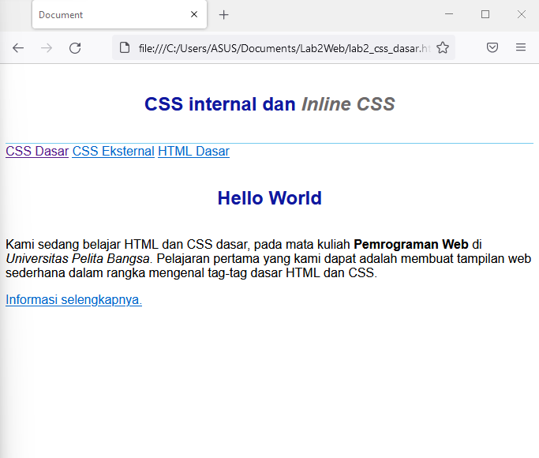

# Lab2Web
><b>Tugaspraktikum2</b>

Nama   : Moch. Nauval faris muzaki
NIM    : 312010122
Kelas  : TI.20.B1
Matkul : Pwmrograman Web
 
 
 1.<b>Membuat dokumen HTML.</b> 
 Untuk langkah awal kita membuat dokumen HTML terlebih dahulu berikut tampilannya 
  

 
  

 2.<b>Mendeklarasikan CCS Internal</b>
 nah selanjutnya kita mendeklarasikan CCS Internal berikut umtuk tampilannya
  

 