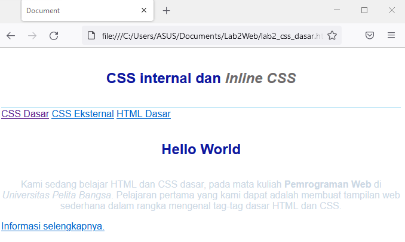
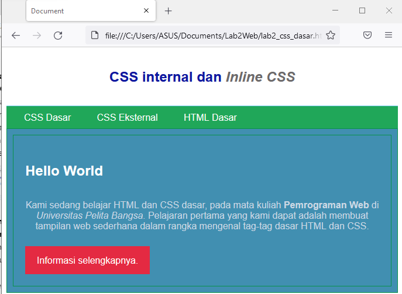

# Lab2Web
><b>Tugaspraktikum2</b>

 |Nama   | Moch. Nauval faris muzaki|
 |NIM    | 312010122|
 |Kelas   | TI.20.B1|
 |Matkul  | Pemrograman Web|
 
 
 1.<b>Membuat dokumen HTML.</b> 
 Untuk langkah awal kita membuat dokumen HTML terlebih dahulu berikut tampilannya 
  

 
  

 2.<b>Mendeklarasikan CCS Internal</b>
  
 nah selanjutnya kita mendeklarasikan CCS Internal berikut umtuk tampilannya
  

 
  

 3.<b>Menambahkan Inline CSS</b>
  
 lalu kita menambahkan deklarasi inline CSS nah berikut tampilannya

 
 

<b>4. Membuat CSS Eksternal</b>
 
 setelah itu kita membuat file baru untuk mendeklarasikan css berikut tampilannya

 

 <b>.5. Menambahkan CSS Selector</b>
 
Selanjutnya menambahkan CSS Selector menggunakan ID dan Class Selector. Pada file 
style_eksternal.css, tambahkan kode berikut

 
1. Lakukan eksperimen dengan mengubah dan menambah properti dan nilai pada kode CSS 
dengan mengacu pada CSS Cheat Sheet yang diberikan pada file terpisah dari modul ini.
 |Jawab : |
2. Apa perbedaan pendeklarasian CSS elemen h1 {...} dengan #intro h1 {...}? berikan 
penjelasannya!
 |Jawab :|
3. Apabila ada deklarasi CSS secara internal, lalu ditambahkan CSS eksternal dan inline CSS pada 
elemen yang sama. Deklarasi manakah yang akan ditampilkan pada browser? Berikan 
penjelasan dan contohnya!
 |Jawab :|
4. Pada sebuah elemen HTML terdapat ID dan Class, apabila masing-masing selector tersebut 
terdapat deklarasi CSS, maka deklarasi manakah yang akan ditampilkan pada browser? 
Berikan penjelasan dan contohnya! ( 
 )
 | Jawab :|
